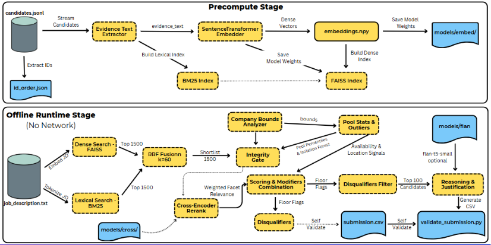

# THIS IS A REPO FOR RANKING SYSTEM DESIGNED FOR REDROB (INDIA RUNS HACKATHON)

This system ranks the top 100 candidates from a pool of 100,000 against a Senior AI Engineer job description. It runs offline on CPU, finishes the ranking pass in under five minutes, and writes a CSV with a score and a one-line justification per candidate. Matching is driven by the semantic relevance of each candidate's career evidence to the job description, not by their self-reported skills list.

## Approach

Ranking is two stages: retrieve, then rerank. The retrieve stage runs BM25 lexical search and dense vector search over the candidate evidence and fuses the two ranked lists with Reciprocal Rank Fusion (k=60) to produce a shortlist. This keeps recall high while bounding the work handed to the expensive stage. The rerank stage scores each shortlisted candidate with a cross-encoder against a small set of facet queries phrased from what the job description means, so relevance reflects demonstrated work rather than keyword overlap.

On top of relevance, an integrity gate removes fabricated profiles. It fits an Isolation Forest on the pool's own suspicious-signal subspace and combines it with interpretable consistency checks. Hard logical contradictions (summed role months exceeding stated experience, a role's duration contradicting its own dates, a start predating the company's plausible age) exclude on their own. Soft "too perfect" anomalies require both the forest and a violation to agree, so genuine high performers are not floored. Small modifiers for behavioral availability and location fit are derived from real pool percentiles, not fixed cutoffs. The one-line justification is built from a deterministic template; an optional fully offline local model (flan-t5-small) can phrase it instead, behind a config flag, with a hallucination guard and a template fallback.

Ranking uses no LLM for the decision and no model trained on labels. The runtime constraints rule out network and heavy compute, and the dataset ships no labels, so a learned-label model would only relearn whatever heuristic generated the labels.

## Architechture



## Two-binary design

precompute.py runs once, offline, with network allowed. It vendors the models into models/, embeds every candidate, builds the FAISS and BM25 indexes, and persists them to artifacts/. rank.py runs at submission time with no network, no model downloads, and no API calls, loading those artifacts and finishing under five minutes on 16 GB of RAM. The split keeps every slow or networked step out of the timed path.

## How to run

The single command that produces the final submission CSV from the candidates file is:

```bash
python rank.py --candidates ./candidates.jsonl --out ./submission.csv
```

### Pre-computation Requirement
This system uses a two-binary design to satisfy offline and runtime constraints:
1. **Pre-computation (Offline, Network Allowed)**: Before running the ranker, you must run the pre-computation script once to download the local model files and build search indices over the candidate pool:
   ```bash
   python precompute.py
   ```
   *Note: This pre-computation phase runs once and may exceed the 5-minute window (typically taking ~6-7 minutes on CPU to embed all 100,000 candidates).*

2. **Submission Generation (Offline, Timed)**: The single command shown above (`python rank.py ...`) loads these pre-computed local artifacts, runs entirely offline, and executes the full candidate ranking pipeline in **under 4 minutes** (typically ~3.7 minutes on CPU), well within the 5-minute evaluation window.

3. **Validation (Self-check)**:
   ```bash
   python validate_submission.py submission.csv
   ```

## Repository structure

- precompute.py: one-time offline build of models, embeddings, and indexes.
- rank.py: runtime ranking, integrity gate, scoring, CSV output, self-validation.
- config.py: all tunable constants, one reason each.
- src/io.py: streaming reader for candidates.jsonl into typed records.
- src/features.py: derives the text evidence used for matching.
- src/retrieval.py: BM25, dense FAISS search, and RRF fusion.
- src/rerank.py: cross-encoder facet scoring of the shortlist.
- src/integrity.py: Isolation Forest plus the consistency checks.
- src/scoring.py: relevance combination and pool-percentile modifiers.
- src/impact.py: quantified-impact signal from role descriptions.
- src/disqualifiers.py: unambiguous hard disqualifiers.
- src/reasoning.py: template and optional local-LLM justifications.
- eval/eval_harness.py: independent offline cohort scorecard.
- validate_submission.py: enforces the output format.
- requirements.txt, submission_metadata.yaml, candidate_schema.json, submission.csv: dependencies, metadata, schema, and the final output.
- job_description.txt: the role description embedded once at runtime.
